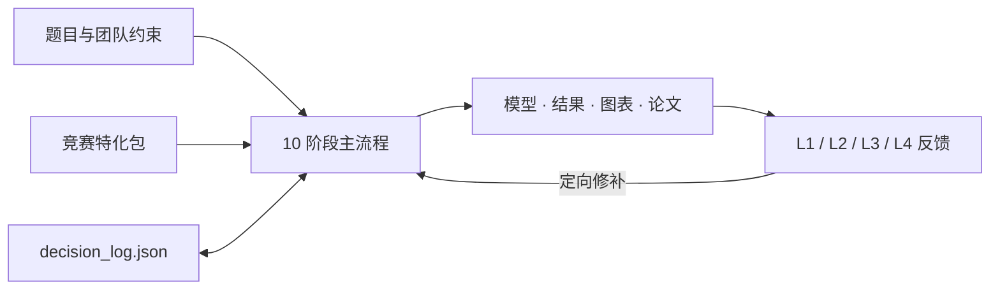

# mathmodel-skill

> A structured Agent workflow for CUMCM, MCM/ICM, and Diangong Cup — designed to keep a 72–96 hour modeling project coherent from the first decision to the final submission.

[](./.codex-plugin/plugin.json)
[](https://github.com/handsomeZR-netizen/mathmodel-skill/actions/workflows/ci.yml)
[](./scripts/doctor.py)
[](./competitions/)
[](./LICENSE)

数学建模比赛很少因为“缺少一个更聪明的回答”而失败。

更常见的情况是：模型已经换了，摘要还没有更新；第二问重新求解后，第三问仍在引用旧结果；某个关键假设只存在于聊天记录里；直到提交前，团队才发现匿名、页数或 AI 使用披露不符合要求。

mathmodel-skill 为这些问题而设计。

它不是一个试图一次生成整篇论文的 Prompt，也不是一个替团队做决定的黑盒 Agent。它是一套可执行的建模工作流：将选题、拆题、模型选择、求解、稳健性分析、论文装配和终审组织为 10 个阶段，并用一份共享决策日志保存整个项目的状态。

当比赛持续数十小时、队员交替协作，或者工作从 Codex 切换到 Claude Code 时，项目仍然能够沿着同一条主线继续，而不是重新依赖聊天上下文和个人记忆。

支持：

- Codex Skills
- Codex Plugin
- Claude Code

日常使用中，你不需要手工维护 JSON，也不需要记住每个脚本的参数。Agent 会在需要判断的节点向团队确认，并负责维护状态、调用工具和整理产物。

[设计动机](#为什么需要它) · [工作方式](#它如何工作) · [设计原则](#设计原则) · [竞赛支持](#竞赛支持) · [快速开始](#quick-start) · [可信边界](#边界与可信度)

---

## 为什么需要它

一场数学建模比赛，本质上不是一道独立问题，而是一组彼此依赖的决定。

选题会影响数据与时间分配；假设会限制模型边界；模型会决定求解方式与图表；结果发生变化后，摘要、评价、灵敏度分析和结论都需要同步调整。

如果这些依赖只存在于对话记录、临时文件或某位队员的记忆里，协作就会逐渐失去一致性。项目可能仍在向前推进，但不同部分已经不再描述同一个模型。

mathmodel-skill 将这些隐含关系显式化。

它帮助团队持续回答四个问题：

1. 现在进行到哪一步？
2. 已经做出了哪些决定？
3. 这些决定基于什么证据？
4. 哪些条件满足后，项目才能继续？

它不保证模型一定正确，也不预测奖项。它做的是更基础、也更重要的事情：让项目可以被恢复、检查、局部修改，并最终交付。

## 它如何工作



整个系统由三部分组成。

### 1. 主流程

主流程定义阶段顺序、进入条件、退出条件和回退路径。

每个阶段都有明确的输入与产物。Agent 不会把整场比赛压缩成一次长执行，而是在可检查的位置停下来，让团队知道已经完成了什么，以及为什么可以继续。

### 2. 共享决策日志

`state/decision_log.json` 是项目的连续记忆。

它记录：

- 竞赛与题目选择
- 模型候选及淘汰理由
- 假设、符号和术语
- 各阶段评分与 verdict
- 子问状态与局部回修
- 规则核对与 AI 使用台账
- 最终交付状态

对话用于交流，日志用于接力。即使上下文切换，项目状态仍然保留在工作区中。

### 3. 确定性工具

语言模型适合分析、比较与生成，但并不适合承担所有机械检查。

因此，评分重算、模板装配、环境诊断、差分应用、AI 披露生成和部分合规检查由脚本完成。模型负责需要判断的工作，脚本负责可以确定的工作，团队保留最终决定权。

## 这套工作流解决什么问题

| 比赛中的常见情况                             | mathmodel-skill 的处理方式                                   |
| -------------------------------------------- | ------------------------------------------------------------ |
| 对话越来越长，早期决定难以追溯               | 所有阶段共用 `state/decision_log.json`，统一保存选择、依据、评分与回退记录 |
| 总体表现尚可，但某个关键维度明显不足         | Verdict 同时检查最低分和加权均分；高严重度问题不能被平均数掩盖 |
| 只有 Q2 需要返工，却牵连全部结果             | Stage 5 按 Qi 保存状态，支持 `refine_partial`，只修改受影响的子问 |
| 三类竞赛要求不同，维护成本不断增加           | 保留一条主流程，通过 competition pack、权重 overlay 和模板表达差异 |
| Markdown 章节已经生成，但主 TeX 没有正确引用 | 模板使用显式 section marker；缺失、重复或未知 marker 会直接失败 |
| 封面或摘要仍含占位符，却被误当作正式稿       | 正式渲染采用 fail-closed 检查；占位符只能用于显式 dry-run    |
| 临近提交才发现页数、匿名或 AI 披露问题       | Stage 0、8、9 会重新打开规则入口；未通过合规门不能进入 `submission_ready` |
| Pandoc、TeX 或依赖问题直到最后才暴露         | `doctor.py` 集中检查结构、竞赛包、Python、Pandoc、TeX 与可选依赖 |

## 设计原则

mathmodel-skill 的设计目标不是加入尽可能多的组件，而是让每个组件只承担自己最擅长的工作。

### 工作流优先于超长 Prompt

更长的 Prompt 可以增加背景信息，却不能天然维护状态、依赖与回退路径。

这里仍然使用模型完成各阶段任务，但“项目现在在哪里”“上一阶段决定了什么”“什么条件下可以继续”由工作流显式维护。上下文可以变化，项目结构不需要随之消失。

### 检索提供证据，不管理流程

RAG 很适合寻找竞赛规则、领域论文、真实数据和方法依据，但它并不负责决定下一阶段，也不会自动判断新结果是否推翻旧假设。

因此，仓库内材料采用版本可控、按阶段加载的竞赛包；外部检索负责提供证据，主流程负责组织行动。

### Multi-Agent 只用于适合并行比较的环节

多个 Agent 在选题比较、模型攻击和终稿评审中很有价值，但如果每一步都依赖多方协商，协调成本和符号漂移会迅速增加。

主流程始终围绕一份共享日志推进。并行视角只出现在适合独立判断的节点；终稿 Panel 可以并行执行，也可以在单 Agent 环境中顺序降级。

### 自动化停在可以检查的位置

单 Agent 并不等于黑盒。

`fast` 和 `standard` 模式都可以由一个 Agent 完成，但每个阶段仍然留下明确产物，关键选择仍然需要确认，评分仍然由脚本重算，问题仍然可以按 section 或 Qi 局部修补。

团队可以随时查看进度、接管项目、切换模型，或回到某个具体决定，而不必从头重做。

## 一些小而重要的设计

### 同一份状态可以被不同工具读取

Codex 与 Claude Code 可以在同一工作区中读取相同的 state schema。这里的共享来自项目目录，而不是云同步，因此切换工具时仍需保留完整工作区与产物。

### 团队回答问题，Agent 维护流程

选竞赛、选题、接受模型、决定回修等节点通过原生选择 UI 或编号列表完成。团队负责方向判断，Agent 负责状态写入、文件组织和脚本调用。

### 只加载当前阶段需要的材料

根目录 `SKILL.md` 只承担调度职责。阶段细则、rubric、竞赛规则和模板按需加载，避免无关内容占用上下文。

### 一条流程服务三类竞赛

CUMCM、MCM/ICM 与电工杯不会被维护为三套互相漂移的工作流。它们的差异被限制在：

- `competitions/<comp>/`
- 题型与阶段权重
- LaTeX 模板
- 提交与披露规则

### 最低分不会被均分覆盖

加权均分可以用于排序，但任何低于门槛的关键维度都需要单独处理。题型权重被限制在 `[0.7, 1.5]`，避免局部偏好过度放大。

### 局部错误优先局部修复

Stage 5 保存每个 Qi 的分数、权重和状态。某个子问失败时，流程只返回真正受影响的位置，而不是默认推翻全部结果。

### 经验数据只作为参照

CUMCM 分位描述的是公开样本中的观察位置，不是官方评分线，也不能用于推导获奖概率。

MCM/ICM 与电工杯的经验层明确记录为 `n=0`，不会生成缺乏数据支持的“经验分位”。

### 规则记录日期，但不假装永久有效

`current_rules.md` 保存最近核对日期和官方入口。Stage 0、8、9 仍要求重新查看当届通知，因为仓库基线不能覆盖未来变化。

### AI 使用从过程开始记录

台账记录工具、版本、使用阶段、用途、采用内容和人工复核。

CUMCM 会根据是否使用 AI 生成相应的支撑材料 PDF 或正文声明；MCM 报告会直接接入主模板，避免截止前再依赖记忆补写。

### 能自动验证的内容不依赖“记得检查”

YAML/JSON、竞赛包、反模式计数、评分边界、模板 marker、渲染 dry-run 和代码模板边界均有自动测试覆盖。

## 10 个阶段

| Stage | 任务               | 关键产物                                 | 主要检查                   |
| ----: | ------------------ | ---------------------------------------- | -------------------------- |
|     0 | 团队启动与资料预扫 | 竞赛、角色、时限、环境、规则基线         | 可执行性与合规入口         |
|     1 | 多题比较与选题     | 选择理由、放弃项、题型判断               | 资源匹配与失败风险         |
|     2 | 问题拆解           | 子问、变量、约束、依赖图                 | 逻辑完整性                 |
|     3 | 模型选型           | 候选模型、证据、反事实与淘汰理由         | 模型与问题的匹配程度       |
|     4 | Foundation         | 假设、符号、术语表                       | 一致性与可解释性           |
|     5 | 递归求解 Q1…Qn     | formulation、代码、结果、图表            | per-Qi 评分与定向回修      |
|     6 | 稳健性分析         | 风险匹配的验证、稳健区间、失败边界       | 灵敏度与结论可靠性         |
|     7 | 模型评价           | 优点、局限、改进、迁移条件               | 边界是否诚实、结论能否推广 |
|     8 | 论文装配           | `paper_workspace/*.md`、TeX/PDF、AI 台账 | 跨阶段一致性与格式合规     |
|     9 | 提交前终审         | 最终 PDF、支持材料、Panel 记录           | 合规门、证据链与视觉检查   |

## 反馈模式

三种模式使用同一条主流程，只调整反馈预算和评审深度。

| Mode           | 反馈层                       | 适用场景                    |
| -------------- | ---------------------------- | --------------------------- |
| `fast`         | L1 单轮                      | 选题试跑、快速 sanity check |
| `standard`     | L1 + L2                      | 默认比赛流程                |
| `championship` | L1 + L2 + L3 + L4 + red-team | 终稿前的深度评审            |

评分工具输出的是流程状态，而不是奖项预测：

`block` · `refine` · `refine_partial` · `pass_with_review` · `pass` · `pass_early` · `carryover`

## 竞赛支持

| 竞赛包           | 语言与模板                                  | 当前材料                                                     | 可信度说明                                                  |
| ---------------- | ------------------------------------------- | ------------------------------------------------------------ | ----------------------------------------------------------- |
| **CUMCM 国赛**   | 中文；XeLaTeX / 原创 `ctexart` 电子论文模板 | 收集 91 份公开论文源样本，其中 59 份成功提取文本并进入统计；42 项维护者反模式检查 | 当前材料最完整；观察分位不是官方门槛，规则以当届通知为准    |
| **MCM/ICM 美赛** | English；pdfLaTeX / `article`               | 16 项维护者检查；已记录 COMAP 2027 页数、字号与 AI 披露基线  | 经验层 `n=0`，不提供论文分位；提交前必须重新核对 COMAP 要求 |
| **电工杯**       | 中文；XeLaTeX / `ctexart`                   | 12 项工程导向检查；已记录官网页序、25 页正文、支撑材料与匿名基线 | 经验层 `n=0`；当前官网未提供专门 AI 格式，仍需检查当届通知  |

截至 2026-07-22，仓库已核对：

- [CUMCM 2026 竞赛规则](https://www.mcm.edu.cn/html_cn/node/9d8e511fe7a1447b35f53a82c908e2e0.html)
- [CUMCM 2026 论文格式规范](https://www.mcm.edu.cn/html_cn/node/4cd596519c9eb9fbd866398f6df0caa3.html)
- [COMAP 2027 Instructions](https://www.contest.comap.com/undergraduate/contests/mcm/instructions.php)
- [电工杯参赛规则](https://shumo.neepu.edu.cn/jszz/csgz.htm)
- [电工杯论文规范](https://shumo.neepu.edu.cn/jszz/lwgf.htm)

这些链接构成仓库当前的规则基线，但不能替代参赛当年的官方文件。

## Quick Start

### Codex

#### macOS / Linux

```bash
git clone https://github.com/handsomeZR-netizen/mathmodel-skill.git \
  ~/.agents/skills/mathmodel-skill

python ~/.agents/skills/mathmodel-skill/scripts/doctor.py \
  --competition cumcm

mkdir -p my-modeling-project
cd my-modeling-project
codex
```

#### Windows PowerShell

```powershell
git clone https://github.com/handsomeZR-netizen/mathmodel-skill.git `
  "$HOME\.agents\skills\mathmodel-skill"

python "$HOME\.agents\skills\mathmodel-skill\scripts\doctor.py" `
  --competition cumcm

New-Item -ItemType Directory -Force my-modeling-project | Out-Null
Set-Location my-modeling-project
codex
```

进入 Codex 后输入：

```text
使用 $mathmodel-skill，开始 CUMCM 建模。
```

首次启动时，Agent 会先确认竞赛、题目、队伍能力、截止时间和题面位置，然后创建共享状态并进入 Stage 0。工作区已经存在状态时，则从最近的检查点继续。

也可以安装到当前项目：

```bash
mkdir -p .agents/skills
git clone https://github.com/handsomeZR-netizen/mathmodel-skill.git \
  .agents/skills/mathmodel-skill
```

### Claude Code

```bash
git clone https://github.com/handsomeZR-netizen/mathmodel-skill.git \
  ~/.claude/skills/mathmodel-skill

mkdir -p my-modeling-project
cd my-modeling-project
claude
```

进入 Claude Code 后输入：

```text
开始建模
```

或：

```text
使用 mathmodel-skill 开始 MCM 建模
```

### 可选：完整数值环境

核心工作流和 `doctor.py --skip-tools` 不依赖完整的科学计算栈。只有在需要运行仓库中的建模起步代码时，才需要安装额外依赖：

```bash
python -m pip install -r \
  ~/.agents/skills/mathmodel-skill/templates/shared/requirements.txt
```

正式进行论文转换与编译时，还需要安装 [Pandoc](https://pandoc.org/installing.html) 和 TeX Live 或 MiKTeX。

简化转换器仅用于 `--no-compile` 结构预检，不应作为正式论文的编译方式。

- CUMCM 与电工杯使用 XeLaTeX
- MCM/ICM 使用 pdfLaTeX

## 工作区产物

```text
my-modeling-project/
├── state/
│   └── decision_log.json       # 决策、评分、回退、规则与 AI 使用台账
├── results/                    # 结构化结果与可复现实验输出
├── figures/                    # 最终图表
├── paper_workspace/            # 01_abstract.md … 10_appendix.md，以及按需披露片段
├── paper_output/               # TeX 中间文件与最终 PDF
└── support_materials/          # 代码、数据清单与竞赛要求的披露材料
```

Codex 与 Claude Code 可以在同一目录中接力。`decision_log.json` 负责保存流程状态，但不会自动同步工作区之外的文件。

## 辅助工具

| 工具                         | 用途                                                  | 典型调用                                                     |
| ---------------------------- | ----------------------------------------------------- | ------------------------------------------------------------ |
| `scripts/doctor.py`          | 检查 skill 结构、竞赛包、环境与工作区                 | `python <skill>/scripts/doctor.py --competition mcm`         |
| `scripts/score_artifact.py`  | 校验 critic JSON、重算加权分数与 verdict、聚合 per-Qi | `python <skill>/scripts/score_artifact.py ...`               |
| `scripts/extract_diff.py`    | 生成并应用 section-level patch                        | `python <skill>/scripts/extract_diff.py --apply ...`         |
| `scripts/render_paper.py`    | 将标准 Markdown 工作区装配为三类竞赛的 TeX/PDF        | `python <skill>/scripts/render_paper.py --competition cumcm --workspace paper_workspace` |
| `scripts/render_ai_usage.py` | 根据台账生成 CUMCM/MCM AI 使用披露材料                | `python <skill>/scripts/render_ai_usage.py --competition mcm ...` |
| `scripts/ingest_papers.py`   | 供维护者离线更新经验统计                              | 见 [`scripts/README.md`](./scripts/README.md)                |

完整 CLI 参数与依赖边界见 [`scripts/README.md`](./scripts/README.md)。

## 仓库结构

```text
SKILL.md                         # 工作流主入口与调度协议
agents/openai.yaml               # Codex UI 元数据
.codex-plugin/plugin.json        # Codex Plugin manifest
skills/mathmodel-skill/SKILL.md  # Plugin 发现 shim
AGENTS.md                        # 仓库维护约定
competitions/
  cumcm/                         # 规则、59 份样本统计、写作启发、评分覆盖与模板骨架
  mcm/                           # COMAP 规则基线；经验统计 n=0
  diangong/                      # 官网规则基线；经验统计 n=0
references/
  stage_00_* ... stage_09_*      # 按阶段加载的执行细则
  feedback_layer1_* ... layer4_* # 阶段评分、回检、Panel 与校准
  model_catalog.md               # 模型候选目录
templates/
  latex/{cumcm,mcm,diangong}/    # 三类竞赛 LaTeX 模板
  shared/                        # 状态、AI 台账、表格与 Python 起步代码
config/dim_weights.json          # 竞赛 × 题型 × 阶段的评分权重
scripts/                         # 环境检查、评分、差分、装配、披露与维护工具
tests/                           # 回归测试与 fixture
```

## v6.1

v6.1 主要补强了环境预检、论文装配、评分一致性、AI 使用披露和数值示例的可靠性。

- 新增 `doctor.py`，统一检查包结构、竞赛包、反模式计数、模板 marker 和工具链状态。
- 三类竞赛生成的 section 会自动接入 `main.tex`。缺失章节、空章节、未知 marker 或重复 marker 都会明确失败，正式编译不会静默降级。
- CUMCM 改用仓库原创、MIT 授权的 `ctexart` 电子论文模板。模板不包含身份字段，并对摘要页、正文页数和最终提交元数据执行 fail-closed 检查。
- 评分器改为由脚本重新计算 verdict，同时校验 stage、iteration、最低分、均分和题型权重，修复旧 verdict 被错误持久化的问题。
- `extract_diff.py --apply` 不再要求与应用差分无关的 critique 输入。
- 新增 AI 使用台账与披露生成器：CUMCM 根据“已使用 / 明确未使用”生成支撑材料 PDF 或正文声明；MCM 报告自动进入主模板，并避免重复标题。
- 补充电工杯官网规则基线，将封面、摘要起始页码、无目录、正文与附录顺序纳入模板和终审门。
- 修复分类交叉验证中的标准化泄漏、优化示例中的不可行贪心基线、熵权法常数列、GM(1,1) 极限和 MAPE 零值边界。
- 将 CUMCM 样本口径校准为“91 份来源、59 份可提取文本”；Stage 9 会根据当前竞赛动态加载对应反模式清单，不再在共享状态中写死数量。
- 加入自动测试和 GitHub Actions，覆盖配置、评分、模板装配、AI 披露与数值边界。

## 边界与可信度

mathmodel-skill 是协作与质量控制工具，不是自动获奖系统。

使用它并不会消除建模本身的不确定性，也不能替代团队对公式、代码、数据、事实、引用和最终署名的责任。

需要特别说明的是：

- CUMCM 统计来自公开样本中成功提取文本的 59 份论文，可能受到年份、题型、来源和 PDF 可提取性的影响。
- `winning_patterns.md`、经验分位和反模式清单属于维护者总结，不是官方 rubric。
- MCM/ICM 与电工杯的经验统计目前均为 `n=0`，相关写作模式只能作为启发，不能解释为实测获奖规律。
- 竞赛规则会变化。仓库保存的是最近一次核对的基线，正式提交前必须以当届官方通知和题目要求为准。
- AI 生成的公式、代码、事实和引用必须由团队复核。台账和披露生成器帮助完整记录，但不代替合规判断。

## 开发与验证

```bash
python -m compileall -q scripts templates/shared/code_starter
python -m unittest discover -s tests -p 'test_*.py' -v
python scripts/doctor.py --competition cumcm --skip-tools
python scripts/doctor.py --competition mcm --skip-tools
python scripts/doctor.py --competition diangong --skip-tools
```

当工作流、模板或竞赛包发生变化时，请同步更新测试、版本号和规则核对日期。

参与贡献前请先阅读 [`AGENTS.md`](./AGENTS.md)。Bug、规则更新与改进建议可以通过 Issue 提交。

## License

仓库原创代码、文档以及三类竞赛装配模板采用 [MIT License](./LICENSE)。运行时依赖和外部资料链接仍遵循各自的许可条款，详细边界见 [`THIRD_PARTY_NOTICES.md`](./THIRD_PARTY_NOTICES.md)。

---

mathmodel-skill 不替团队完成思考。

它做的是让每一次判断都留下依据，让每一次修改都知道影响范围，也让一场漫长的建模协作最终能够被完整地交付。
